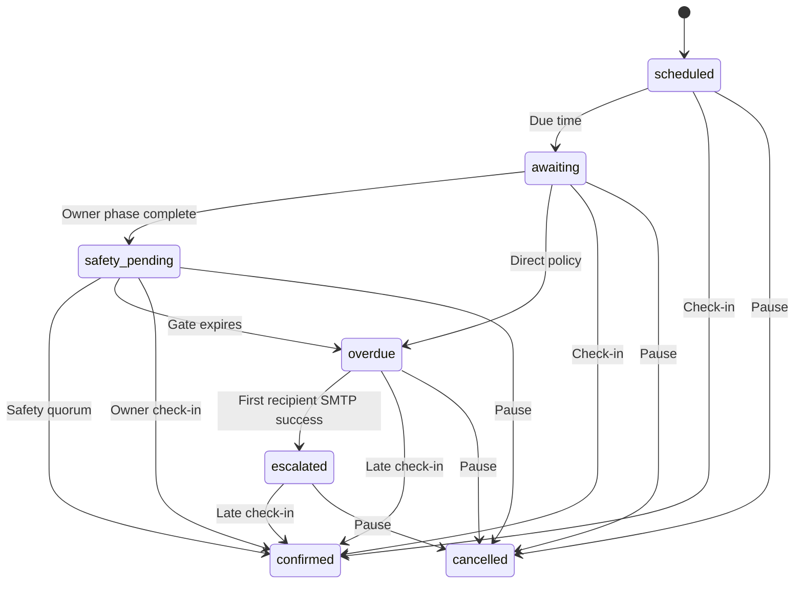

# Pulse architecture

## Deployment boundary

The project has one intentionally public directory:

```text
Pulse/
├── app/                 Application code, never public
├── config/              Environment-backed configuration, never public
├── database/            Schema and migrations, never public
├── docs/                Documentation, never public
├── public/              Web-server document root
│   ├── assets/
│   ├── cron/cron.php    Token-protected notification runner
│   └── index.php
├── storage/             Logs and private documents, never public
├── tests/               Development tests, never public
├── tools/               Command-line tools, never public
└── bootstrap.php
```

The web server must use `Pulse/public` as its document root. A URL such as `/monitors` is internally rewritten to `public/index.php`.

The front controller reaches the rest of the application explicitly:

```php
$container = require dirname(__DIR__) . '/bootstrap.php';
```

In that expression, `__DIR__` is `Pulse/public`; `dirname(__DIR__)` is therefore `Pulse`. Root `bootstrap.php` then resolves `app`, `config`, and `storage` relative to its own directory. URL rewriting and PHP filesystem resolution are separate mechanisms.

## Request flow

```text
HTTP request
    ↓
public/.htaccess
    ↓
public/index.php
    ├── trusted-host validation
    ├── security headers
    └── CSRF validation for POST
    ↓
Router
    ↓
Controller
    ↓
Service / Repository
    ↓
View or download response
```

`public/index.php` remains deliberately thin. The root bootstrap builds the services and repositories; the front controller defines routes and performs cross-cutting HTTP checks.

## Layers

### Core

`app/Core` contains framework-like infrastructure:

- `Environment` — process and optional `.env` values
- `Request` — typed, immutable request input
- `Session` — cookie policy and session lifetime
- `CsrfTokenManager` — session-bound CSRF tokens
- `SecurityHeaders` — central response policy and host validation
- `ErrorHandler` — production-safe diagnostics
- `MigrationRunner` — ordered SQL migrations and checksums
- `EmailAddressValidator` — local format validation and conservative typo suggestions without contacting recipients
- `NotificationLanguage` — validates recipient-specific mail languages and legacy fallback
- `WebCronAuthenticator` — authorizes the public background runner with constant-time token comparison
- `Database`, `Router`, `View`, `Translator`, and `Logger`

### Controllers

Controllers enforce authentication and ownership, validate request-level intent, invoke services/repositories, and render or redirect.

Document actions have their own `DocumentController`; they are no longer mixed into the monitor controller. `RecipientController` owns monitor-scoped recipient configuration and history. `SafetyController` exposes the public read-only safety page and explicit response action without requiring an owner login.

### Services

- `AuthService` verifies credentials and maintains authentication state.
- `LoginThrottleService` applies account and network limits through opaque hashes.
- `DocumentService` owns upload policy and private filesystem operations.
- `MonitorStateMachine` defines every legal persisted check-cycle transition.
- `MonitorExecutionService` owns cycle creation, UTC scheduling, global check-in, pause/resume, notification-state transitions, and lifecycle audit entries.
- `NotificationScheduler` opens due cycles and coordinates owner notices, optional safety gates, overdue transitions, and recipient release staging.
- `MailQueueWorker` claims jobs with expiring leases, invokes the transport outside the database transaction, then atomically records success or retry state.
- `NotificationComposer` freezes owner, safety-contact, recipient, and test-message content in the actual addressee's stored language before queueing.
- `EscalationService` starts fail-closed safety gates, stores hashed tokens, records deliberate responses, postpones qualified cycles, expires fully delivered gates, and stages immutable recipient releases.
- `TestNotificationService` exercises the same queue and worker path from the authenticated profile action.

`app/Mail` contains the transport boundary and the authenticated SMTP implementation. Later releases will connect encryption, key management, and a secure document portal to this lifecycle.

### Repositories

Repositories own prepared SQL. Ownership-sensitive queries bind the current user through the relevant parent record.

`MailQueueRepository` owns idempotent enqueueing, `FOR UPDATE SKIP LOCKED` claims, expiring leases, attempt history, successful owner/safety accounting, recipient-delivery state, honest escalation on first delivery, and explicit failed-job requeueing.

`MessageRepository` saves a monitor's default message and all recipient overrides in one database transaction. Its ownership check locks the monitor and accepts override IDs only from that monitor's current assignments.

`MonitorRepository::ReplaceContactsForMonitor()` now synchronizes assignments:

- retained contacts keep the same `monitor_contacts.id`
- new contacts receive a new assignment row
- only removed contacts are deleted
- ordering is updated in place

This is essential because recipient messages and document-recipient links reference the assignment ID.

`RecipientRepository` separates a reusable contact from one monitor's recipient role. It owns personal-message selection, document assignments, and historical delivery lookup. Immutable release rows refer to the underlying contact ID when it still exists, but also carry their own name, address, language, subject, and body snapshot.

## Domain model

```text
User
├── Contacts
└── Monitors
    ├── Check cycles
    │   ├── Safety requests
    │   │   └── Hashed response tokens
    │   └── Recipient releases
    │       └── Immutable deliveries
    ├── Safety-contact assignments
    ├── Default message
    ├── Monitor contacts
    │   └── Recipient-specific messages
    └── Documents
        └── Document-recipient assignments
```

Documents belong to monitors. Delivery selection is modeled independently through `document_monitor_contacts`, allowing one document to be assigned to several recipients without duplicate storage. File contents live in private filesystem storage; editable text documents and their metadata live in the database.

## Monitor timing

Database timestamps are UTC. Each active monitor has one current row in `check_cycles`. `last_confirmed_at` and `next_check_due_at` on the monitor are indexed display/runtime caches; the cycle is the persisted source of lifecycle state.

A cycle snapshots:

- its UTC start and due timestamps
- its response deadline
- the reminder interval and reminder limit in force when scheduled
- the direct or safety-contact escalation policy
- safety response, reminder, quorum, and postponement settings
- the number of owner reminders actually sent
- safety-gate start, deadline, and confirmation progress
- confirmation, overdue, escalation, or cancellation timestamps

The pure `MonitorStateMachine` allows these transitions:



`confirmed` and `cancelled` are terminal. A successful check-in closes the current cycle and creates a separate new `scheduled` cycle.

`MonitorExecutionService` locks monitor rows and wraps all affected cycle, monitor, and audit changes in one database transaction. A global check-in selects every active monitor belonging to the user, applies one shared UTC confirmation time, and calculates each new due time from that monitor's individual interval. Paused monitors are excluded.

Scheduled cycles become `awaiting` when their due time arrives. Dashboard and monitor-page requests perform this idempotent synchronization; the cron scheduler performs it for all active users without requiring browser traffic.

Pausing transitions the open cycle to `cancelled`, records `paused_at`, and clears the active due date. Resuming treats the resume instant as a fresh confirmation and creates a new scheduled cycle. Pause and resume therefore cannot revive stale deadlines.

The user-facing status model is:

- **Checked in** — the current cycle is `scheduled`
- **Awaiting check-in** — the current cycle is `awaiting`
- **Awaiting safety contact** — the current cycle is `safety_pending`
- **Overdue** — the owner phase and any optional safety gate completed without a qualifying confirmation
- **Escalated** — at least one recipient message was accepted by SMTP and the cycle is `escalated`
- **Paused** — the schedule is deliberately suspended

Elapsed time alone never produces **Overdue**. `MarkCycleOverdue()` additionally requires `due_notice_sent_at`, `reminders_sent >= max_reminders`, and the complete response/reminder window to have elapsed. A safety gate starts its clock only after all initial requests were accepted by SMTP and cannot expire while a configured safety reminder is undelivered. A permanent notification failure adds a visible warning without falsifying lifecycle state.

Direct recipient staging happens after the owner phase. Safety-gated staging happens only after `safety_pending` expires. The first recipient SMTP success atomically changes the cycle from `overdue` to `escalated`; a total failure leaves it `overdue`. A late owner check-in can close any open state, but cannot undo mail already accepted by SMTP.

## Notification queue

Each queue row is an immutable delivery snapshot: recipient address, already-localized subject and body, type, cycle, reminder number, and idempotency key. Editing a profile, contact, or notification language after enqueueing does not rewrite an already pending message.

The once-per-minute `notifications:run` command and the protected `/cron/cron.php` web endpoint perform the same two bounded phases:

1. synchronize cycles and ensure every eligible owner, safety, and recipient stage has its idempotent jobs
2. claim and deliver a limited batch of available jobs

A claim uses an InnoDB row lock with `SKIP LOCKED`, changes the job to `processing`, and assigns a unique worker ID plus an expiry time. SMTP I/O occurs after the claim transaction commits. A second worker therefore skips that job. If the first process dies, a later worker converts the expired lease to `retrying` or `failed` according to its attempt limit.

Successful SMTP completion, the `sent` queue state, `mail_log` entry, linked lifecycle or release state, and notification audit entry are committed together. The initial due notice records `due_notice_sent_at`; later owner and safety reminders advance only after success. Recipient success updates its delivery snapshot and release totals and records escalation on the first success. Failed attempts clear the lease and schedule a configured retry. A manual requeue resets the linked recipient state as well as the failed queue job. Check-in or pause cancels unsent work for the closed cycle; a worker also cancels a claimed notification that is no longer deliverable.

The web endpoint authenticates a normal GET request with `PULSE_CRON_TOKEN`, starts no login session, accepts no run parameters, and takes its batch limit from configuration. The command-line interface remains available for hosts with shell cron.

Notification language belongs to the message recipient rather than the browser session. `users.notification_locale` controls owner reminders and tests; `contacts.notification_locale` controls safety and recipient mail. Null legacy values resolve to `PULSE_DEFAULT_LOCALE`.

The interface converts UTC timestamps to `PULSE_DISPLAY_TIMEZONE`, which defaults to `Europe/Berlin`.

## Configuration

Committed configuration files contain no credentials. `Environment` reads process variables first and then values from an ignored root `.env` file. Process variables always win.

Production mode forces debug output off unless the environment is explicitly non-production. Session, throttle, upload, host, and development controls are centralized in `config/app.php`.

`config/version.php` is generated by `tools/write_version.py` before PHP files are uploaded. A Git checkout normally uses `git describe`; `PULSE_VERSION` can supply an explicit value. Bootstrap guards a missing file and passes an empty version to the view, which displays a localized **version unavailable** label and uses `unversioned` only as the asset cache key.

## Migrations

Application bootstrap checks `schema_migrations`, verifies migration hashes, and applies pending `.sql` files in lexical order before handling the request. An up-to-date installation performs only the read-only version check. An installation that needs work acquires a database-specific advisory lock first, so simultaneous requests cannot apply a migration twice.

For a pre-0.3.0 database with application tables but no migration history, it records migrations 001 and 002 as a legacy baseline and then applies all later migrations in order. It never recreates or drops the existing application tables during that baseline operation.

`tools/migrate.php` remains available as an optional command-line diagnostic for development environments. It is not required for installation or upgrades.

Applied migration files must never be edited after release; create a new migration instead.

## Document storage

New uploads are:

- validated using actual file size and Fileinfo MIME detection
- limited by a configurable allowlist
- renamed to a 64-hex-character random basename with a `.bin` suffix
- stored under `storage/uploads/monitor-documents`
- assigned filesystem mode `0600`
- delivered only through an authenticated, ownership-checked controller

This prevents direct web access and executable filename behavior. It is not encryption. Messages and editable text documents are also unencrypted database values in 0.7.0. Recipient notification mail contains only the effective message; document assignments never create a public link. A later secure-storage release will add authenticated encryption, key versioning, and a recipient document portal without changing the assignment model.
